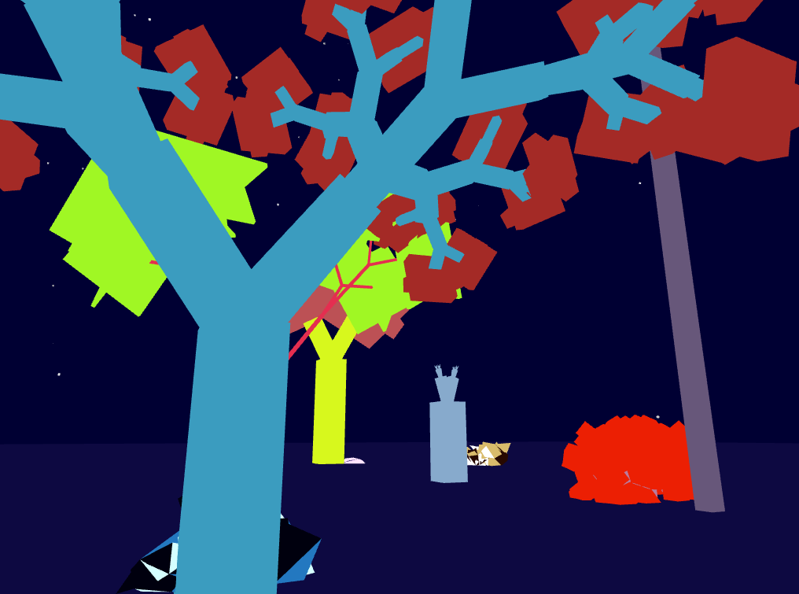

# Forest

Forest is an generative exploration game: as you wander in new directions, the
world is created based on what you showed preference for before.

Forest is a port of a hackathon project I did on the Oculus
(https://github.com/BrownRiceRice/oculus-hackrice16).



## Installation

Requires the following packages:

```
sudo apt-get install libfreetype6-dev libglfw3-dev libglew-dev libyaml-cpp-dev
```
